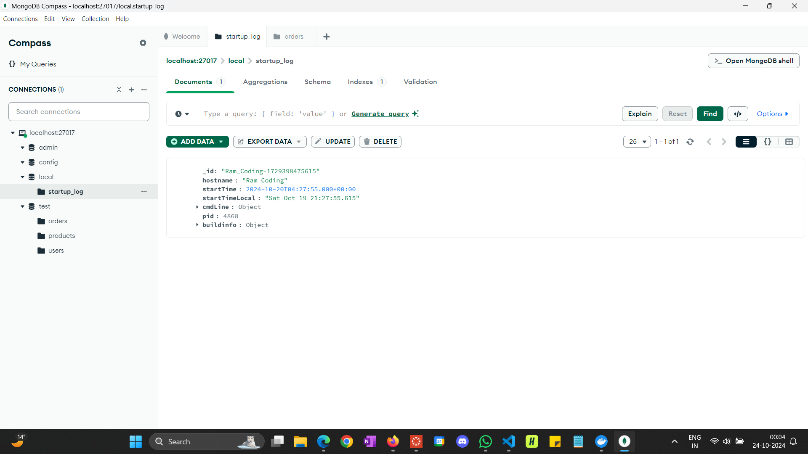

# Kubernetes Cluster App

## Images

Here are the screenshots of the app:

## pods and services Status

## Docker Images

## Kubernetes Cluster

## Mongo DB

## web app accessed via localhost ports

